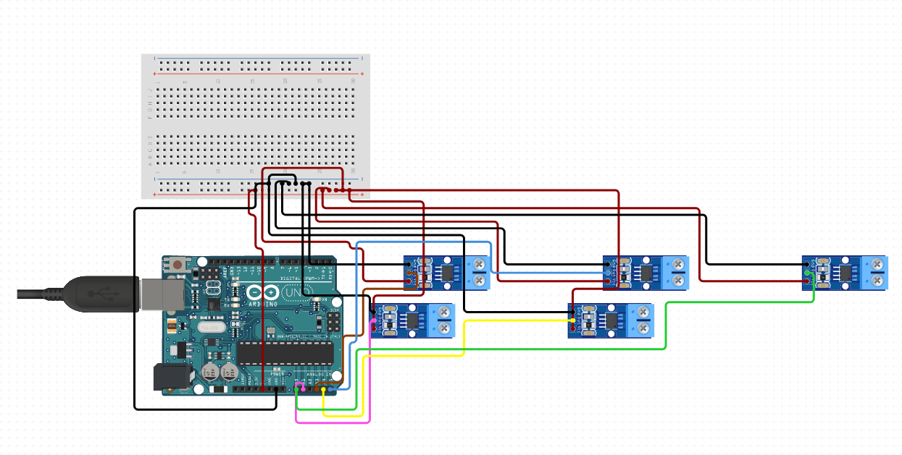

# Arduino-Python-PYQT5-Serial-Communication
Read Sensor Data using arduino adc ports and Print them in Python PyQt Panel

Functions Need to be Added
1. Add Status Led in Current Panel
2. Add Dtc Status Check in led on off panel

### Schematic
[Circuit](https://github.com/AasaiAlangaram/Arduino-Python-PYQT5-Serial-Communication/blob/master/Schematic.PNG)

